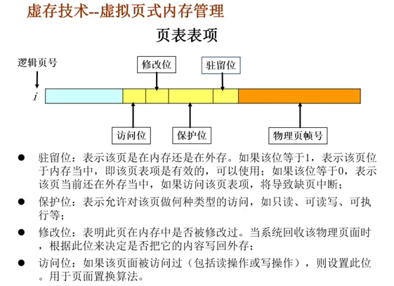

## 操作系统如何申请以及管理内存的？
- 申请内存：当小于128k时，brk 移动\_edata 指针，当大于128k时，mmap 寻找空闲的空间分配
- 内存管理
  - 分配与回收：分配 brk 与 mmap，brk先分配的必须等后分配的回收后才能回收，超过一定期限压缩
  - 内存空间扩充：利用虚拟存储，从逻辑上扩充内存，页表存储逻辑地址与物理内存的映射关系，为了解决地址过大与效率问题，分别有 TLB 缓存与分页页表（倒排页表与散列表）。当内存满时不同的页面置换算法换出分页。分页存储了索引与标志位及物理页帧号
  
  - 地址转换：逻辑地址转换成相应的物理地址（页表）
  - 存储保护：保证各道作业在各自催存空间中运行，互不干扰
## 简述操作系统中的缺页中断
程序执行时，需执行的指令或访问的数据尚未在内存中，由处理器通知操作系统将相应的页面或段调入到内存中（内存不足时，需要从内存中调出一个页面到磁盘交换区）
## 简述操作系统中 malloc 的实现原理

## Linux 中虚拟内存和物理内存有什么区别？有什么优点？
- 虚拟内存优点
  - 大的用户空间
  - 
## 简述 Linux 零拷贝的原理
## 简述 mmap 的使用场景以及原理
## 参考
[CS-Notes](https://github.com/CyC2018/CS-Notes)