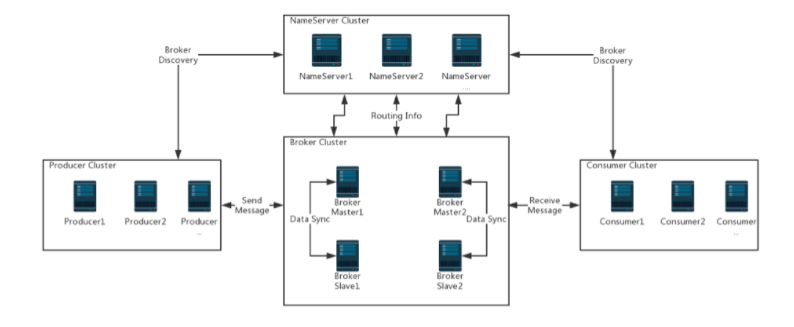

## 架构

### NameServer
`RocketMQ`的注册中心，每个 NameServer 保存着全量的路由信息。 Broker 启动时将自身信息注册在 NameServer 上。Producer 与 Consumer 从 NameServer 获取 Broker 的路由信息。NameServer 是`AP`模型，保持最终一致性。
- 一致性：Broker 注册后会30秒发送一次心跳；NameServer会每10秒自检一次，当 Broker 超过120秒没有发送心跳包后，移除 Broker；客户端也会每30秒更新一次路由信息，当恰好在定时任务的间隔访问挂掉的 Broker 可以使用重试机制

### Broker
`RocketMQ`的服务，作用是存储与转发消息，消息以 Topic 划分，同一个 Topic 下，可以有不同的 tag。
- 可用性：Broker 可以做集群部署
- 可靠性：为了避免单点故障，可以做主从
### Producer
生产者，发送消息，发送逻辑一致的 Producer 可以组成一个 Group
- 消息发送规则：自增轮询方式选择 MessageQueue （默认）、随机选择 MessageQueue、空实现

#### 延迟消息
1. Producer 发送某个 Topic 的延迟消息
2. Broker 收到消息后，判断是延迟消息，使用临时存储存储起来
3. Broker 内部通过 delay service 判断消息是否到期，到期后将消息投递到对应 Topic
4. 消费者消费延迟消息

### Consumer
消费者，消费消息，消费逻辑一致的 Consumer 可以组成一个 Group

## 通信机制

## 常见特性
### 可靠性
1. 消息刷盘才返回
2. 主从备份
### 顺序性
1. Producer 是单线程同步发送
2. Producer 发送的消息路由到相同的 MessageQueue
3. Consumer 加锁单线程消费
### 事务性

1. 发送半消息到`RocketMQ`
2. 半消息刷盘，回应成功
3. 执行本地事务
4. 根据本地事务执行结果，提交或者回滚之前的半消息
5. 未收到确认半消息通信时，发起消息回查（默认回查15次，每次间隔60秒）
6. 检查本地事务状态
7. 根据本地事务状态提交或者回滚之前的半消息

## 参考
[RocketMQ Architecture](http://rocketmq.apache.org/docs/rmq-arc/)
[design](https://github.com/apache/rocketmq/blob/master/docs/cn/design.md)
[The Design Of Transactional Message](http://rocketmq.apache.org/rocketmq/the-design-of-transactional-message/)