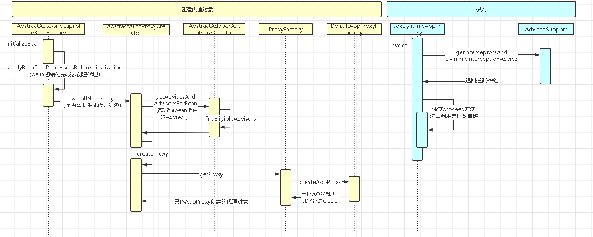
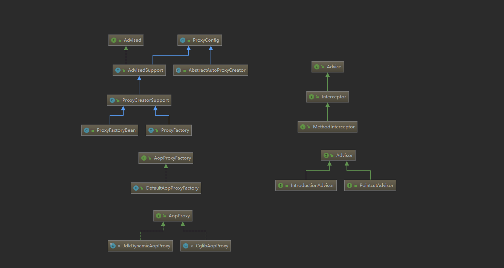

## 概览

>AOP（Aspect Oriented Programming）面向切面编程。通过预编译方式和运行期动态代理实现程序功能的统一维护的一种技术。
>

## 常见使用场景
- Authentication（权限）：例如访问、操作权限
- Cacheing（缓存）
- Error handing（错误处理）：例如ExceptionAdvice，全局异常处理，简化代码
- Transactions（事务）：@Transaction注解
- logging、tracing、profiling and monitoring（记录、跟踪、监控）：例如统一记录入参出参耗时；pinpoint（应用性能管理工具）

## 代理模式简介

[代理模式简介](https://www.jianshu.com/p/c152bceb654f)

## 核心概念
- 连接点（JoinPoint）：程序执行过程中某个特定的点，比如某方法调用的时候或者处理异常的时候。在Spring AOP中，连接点都是方法级别；在AspectJ中连接点还可以是构造器、字段。
- **通知（Advice）**：在特定的连接点上执行的操作。对功能的增强处理。
- **切入点（Pointcut）**：匹配连接点的断言。通知和一个切入点表达式关联，并在满足这个切入点表达式的连接点上运行。Spring AOP缺省使用AspectJ切入点语法，但没哟支持所有的AspectJ语法，比如针对字段与构造函数的切入点语法。
- 切面（Aspect）：关注点的模块化，通知和切入点的结合。
- 目标对象（Target Object）：被一个或多个切面通知的对象。Spring AOP中是被代理对象，属于IOC管理对象。
- AOP代理（AOP Proxy）：AOP框架创建的对象。
- 引入（Introduction）：用来给一个类型声明额外的方法或属性（也被称为连接类型声明）。Spring允许引入新的接口（以及一个对应的实现）到任何被代理的对象。例如，你可以使用引入来使一个bean实现IsModified接口，以便简化缓存机制。
- 织入（Weaving）：把切面连接到其他应用程序类型或对象上，创建代理对象。

### 通知类型
- 前置通知（Before advice）：在某连接点之前执行的通知。
- 后置通知（After returning advice）：在某连接点正常完成之后的通知。
- 异常通知（After throwing advice）：在方法抛出异常退出时执行的通知。
- 最终通知（After(finally) advice）：在某连接点退出的时候执行的通知。
- 环绕通知（Around advice）：包围一个连接点的通知。

### 织入方式
- 编译时：AspectJ编译器
- 类加载时：特殊的类加载器，如Spring的LoadTimeWeaver
- 运行时：Spring AOP

## Spring AOP
### 使用
#### 声明一个切面

```java
package com.example.aopdemo.aop;
import org.aspectj.lang.annotation.Aspect;
@Aspect
public class DemoAspect {
}
```

#### 声明一个切入点
- Spring AOP支持的切入点指示符
  - execution：匹配方法执行的连接点。execution表达式的语法-execution(modifiers-pattern? ret-type-pattern declaring-type-pattern?name-pattern(param-pattern) throws-pattern?)
     - ()中依次和方法签名匹配
     - modifiers-pattern：方法的可见性，如public、protect
     - ret-type-pattern：方法的返回值类型
     - declaring-type-pattern：方法所在类的全路径名
     - name-pattern：方法名
     - param-pattern：方法的参数类型
     - throws-pattern：方法抛出的异常类型
     - *为通配符，主要匹配单个单词
     - ..表示0个或多个项，主要用于包路径和param-pattern
  - within：匹配特定类型的连接点，粒度为类。表达式语法为within(declaring-type-pattern)；例如within(com.spring.service.\*)匹配com.spring.service下所有类，不包含子包，想包含子包使用within(com.spring.service..\*)
  - args：匹配指定参数类型和指定参数数量的方法，表达式的语法为：args(param-pattern)，args中通配符只能使用..，不能使用\*
  - this和target：匹配特定类型的连接点，表达式语法为this(declaring-type-pattern)、target(declaring-type-pattern)，不予许使用通配符；不同点在于this指代的是代理对象，target指代的是目标对象（被代理对象），当有多个切面，使用的JDK动态代理时可能会有不同
  - @within与@target：都为类级别的注解匹配，表达式语法@within(annotation-type)
  - @annotaion：方法级别的注解匹配，表达式语法为@annotation(annotation-type)
  - @args：匹配指定注解标注的类作为参数的连接点，表达式语法@args(annotation-type)
- 切入点表达式可以使用&&、||、!来进行组合

example
```java
@Aspect
public class DemoAspect {
    /**
     * execution,匹配方法
     */
    @Pointcut("execution(public java.lang.String com.example.aopdemo.controller.TestAspectController.execution())")
    public void executionPointcut(){}

    /**
     * within,匹配指定类型的所有方法
     */
    @Pointcut("within(com.example.aopdemo.controller.WithinController)")
    public void withinPointcut(){}

    /**
     * args,匹配一个参数且类型为Integer的方法
     */
    @Pointcut("args(java.lang.Integer)")
    public void argsPointcut(){}

    /**
     * @annotation,匹配方法上有com.example.aopdemo.aop.FishAnno注解的方法
     */
    @Pointcut("@annotation(com.example.aopdemo.aop.FishAnno)")
    public void anno(){}

    /**
     * 切入点的组合表达式，WithinController内的方法，并且有一个参数类型为Integer的方法
     */
    @Pointcut("withinPointcut() && argsPointcut()")
    public void comb(){}
}
```

#### 声明通知
```java
@Aspect
public class DemoAspect {
    /**
     * execution,匹配方法
     */
    @Pointcut("execution(public java.lang.String com.example.aopdemo.controller.TestAspectController.execution())")
    public void executionPointcut() {
    }

    /**
     * within,匹配指定类型的所有方法
     */
    @Pointcut("within(com.example.aopdemo.controller.WithinController)")
    public void withinPointcut() {
    }

    /**
     * args,匹配一个参数且类型为Integer的方法
     */
    @Pointcut("args(java.lang.Integer)")
    public void argsPointcut() {
    }

    /**
     * @annotation,匹配方法上有com.example.aopdemo.aop.FishAnno注解的方法
     */
    @Pointcut("@annotation(com.example.aopdemo.aop.FishAnno)")
    public void anno() {
    }

    /**
     * 切入点的组合表达式，WithinController内的方法，并且有一个参数类型为Integer的方法
     */
    @Pointcut("withinPointcut() && argsPointcut()")
    public void comb() {
    }

    /**
     * 前置通知，也可以直接写如切入点表达式，而不引用切入点方法，像这样
     * @Before("execution(public java.lang.String com.example.aopdemo.controller.TestAspectController.execution())")
     */
    @Before("executionPointcut()")
    public void beforeAdvice() {
        System.out.println("beforeAdvice");
    }

    /**
     * returning = "returnObj"可以让我们获取到方法的返回值，名称必须和通知的参数名称匹配上
     */
    @AfterReturning(pointcut = "withinPointcut()", returning = "returnObj")
    public void afterReturningAdvice(Object returnObj) {
        System.out.println("afterReturningAdvice");
    }

    /**
     * throwing = "ex"可以让我们限制接受异常的类型，同样的名称必须和通知的参数名称匹配上
     */
    @AfterThrowing(pointcut = "anno()", throwing = "ex")
    public void throwingAdvice(Exception ex) {
        System.out.println("throwingAdvice");
    }

    /**
     * finally通知，不管是正常返回还是抛异常都会执行
     * joinPoint.getArgs()可以获取到参数
     */
    @After("comb()")
    public void afterAdvice(JoinPoint joinPoint) {
        joinPoint.getArgs();
        System.out.println("afterAdvice");
    }

    /**
     * 环绕通知
     */
    @Around("comb()")
    public Object aroundAdvice(ProceedingJoinPoint proceedingJoinPoint) throws Throwable {
        System.out.println("aroundAdvice before");
        Object obj = proceedingJoinPoint.proceed();
        System.out.println("aroundAdvice after");
        return obj;

    }
}
```

- 通知获取参数
  - 通过&& args(参数名称)+在通知方法里加上对应名称参数；可以使用argsName进行匹配
- 通知执行顺序：当未指定切面顺序时，执行顺序是未知的，可以通过在切面类中实现org.springframework.core.Ordered 接口或者用Order注解标注切面顺序（同一个切面内有两个相同通知，哪个先执行顺序也是未知的），Ordered.getValue()方法返回值（或者注解值）较低的那个有更高的优先级。
  
#### 声明一个引入
```java
@Aspect
public class UsageTracking {

   /**
   * @DeclareParents声明一个引入com.xzy.myapp.service下的所有类添加接口UsageTracked，默认实现是DefaultUsageTracked
   */
  @DeclareParents（value="com.xzy.myapp.service.*+",
                  defaultImpl=DefaultUsageTracked.class）
  public static UsageTracked mixin;
  
  @Before（"com.xyz.myapp.SystemArchitecture.businessService（） &&" +
          "this（usageTracked）"）
  public void recordUsage（UsageTracked usageTracked） {
    usageTracked.incrementUseCount（）;
  }
  
}
```


### 运行时序图

关键方法
- findEligibleAdvisors：找到适合的advisor（单个通知），这个方法将我们配置的切面找出适合当前类的通知
- createAopProxy：创建AopProxy，决定了是使用JDK动态代理还是CGLIB代理
- getInterceptorsAndDynamicInterceptionAdvice：JDK动态代理时，访问每一个有通知的方法时，返回了适合该方法的通知转换的方法拦截器链
- proceed：通知和连接点方法都在该函数中调用执行，CGLIB与JdkDynamicAopProxy流程大致相同，只不过类和方法换了下；
  - 入口：JDK-JdkDynamicAopProxy.invoke、CGLIB-DynamicAdvisedInterceptor.intercept
  - proceed调用类：JDK-ReflectiveMethodInvocation、CGLIB-CglibMethodInvocation

### 相关类图分析

- Advisor：单个通知，方便匹配、运行；IntroductionAdvisor（引入Advisor）、PointcutAdvisor（除了引入的所有切入点advisor）
- Advised：定义了Advice与Advisor相关操作
- ProxyConfig：代理相关配置，其中最重要的是proxyTargetClass 是否使用CGLIB代理
- ProxyFactory：自动化方式创建代理的代理工厂，获取Aop代理工厂获取代理
- ProxyFactoryBean：给指定bean创建代理的一种方式
- MethodInterceptor：方法拦截器，通知方法都转化成了MethodInterceptor链，放射执行
- JdkDynamicAopProxy：JDK动态代理创建类
- CglibAopProxy：CGLIB动态代理创建类

## 参考
- [Spring中文手册](https://m.php.cn/manual/view/21714.html)
- [Spring官方文档](https://docs.spring.io/spring-framework/docs/current/reference/html/core.html#aop)
- [AOP切点表达式用法总结](https://www.cnblogs.com/zhangxufeng/p/9160869.html)


